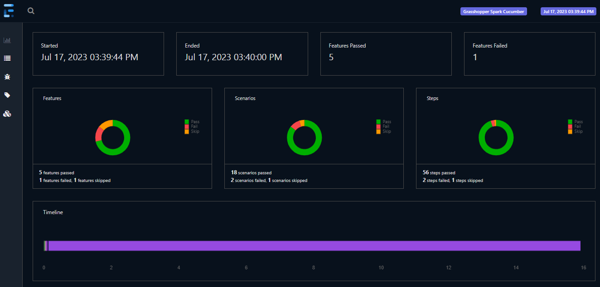
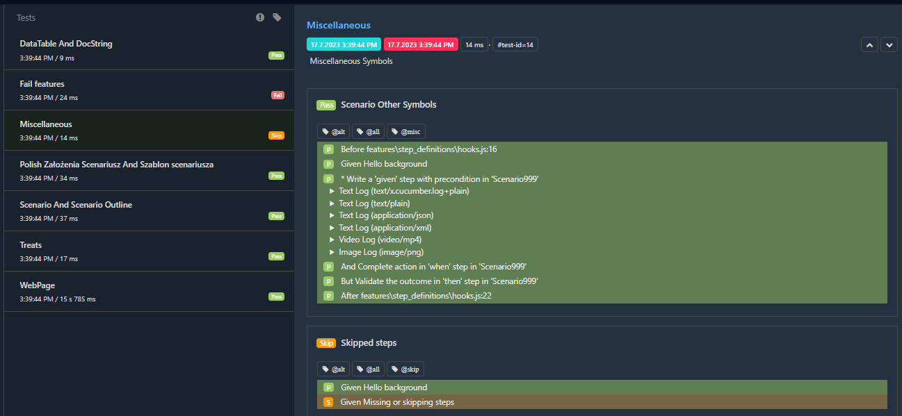

# cucumber-js-extent-report
This Cucumber-JS plugin generates the Spark Extent report. This report is a port of the [Extent Report](https://www.extentreports.com/), using JS with Node and Nunjucks templating.
The design, logic and media artifacts all belong to the [creators](https://github.com/extent-framework) of Extent Report

## DASHBOARD

## TESTS

